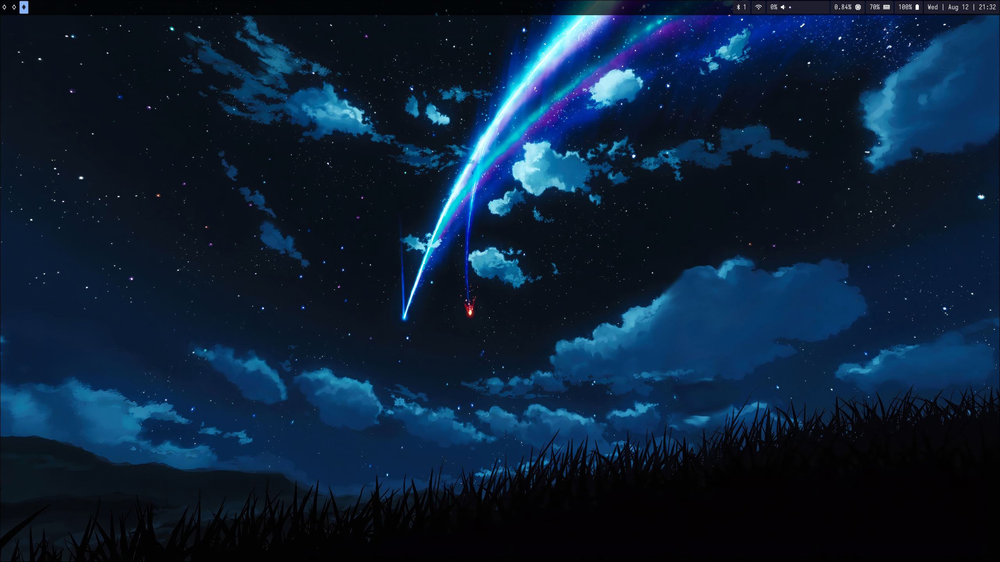
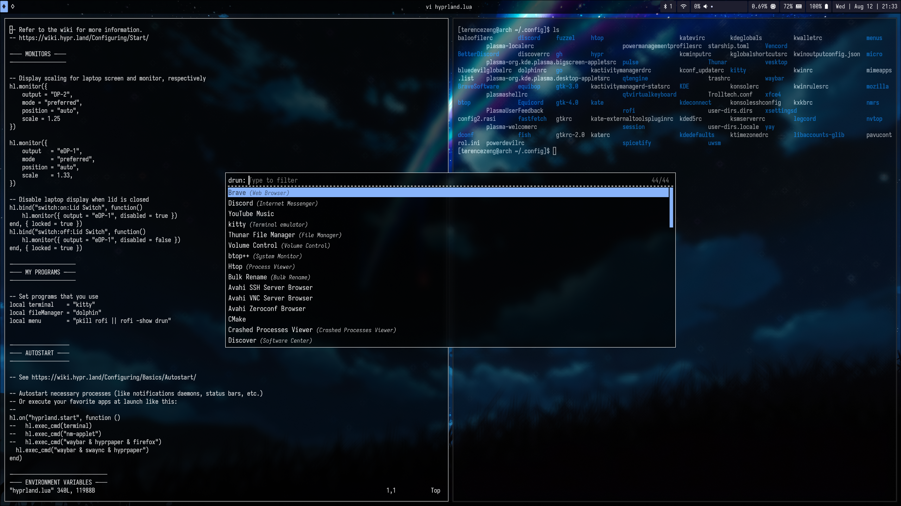

Currently, I'm using Arch (btw) as my distro with Niri as my window compositor. My main goal is to create a lightweight but polished environment that can run on low-resource machines (like my T480 with 8GB of RAM).

I previously used Hyprland as well, but I found that the workflow of Niri works particularly well with smaller laptop screens and switching between adjacent windows is seamless.

---

### Packages

I try to keep my list of installed packages to an absolute minimum. As of September 23, 2026, I have __ packages (not including dependencies):

(To be added)

---

### Screenshots

